## Goals of this lecture

There are many ways to *describe* a distribution. 

Here we will discuss:
- Measurement of the relationship between distributions using **linear, regression analysis**.

## Importing relevant libraries


```python
import numpy as np
import matplotlib.pyplot as plt
import seaborn as sns ### importing seaborn
import pandas as pd
import scipy.stats as ss
```


```python
%matplotlib inline 
%config InlineBackend.figure_format = 'retina'
```


```python
import pandas as pd
df_estate = pd.read_csv("data/models/real_estate.csv")
df_estate.head(5)
```


<div>
<style scoped>
    .dataframe tbody tr th:only-of-type {
        vertical-align: middle;
    }

    .dataframe tbody tr th {
        vertical-align: top;
    }

    .dataframe thead th {
        text-align: right;
    }
</style>
<table border="1" class="dataframe">
  <thead>
    <tr style="text-align: right;">
      <th></th>
      <th>No</th>
      <th>house age</th>
      <th>distance to the nearest MRT station</th>
      <th>number of convenience stores</th>
      <th>latitude</th>
      <th>longitude</th>
      <th>house price of unit area</th>
    </tr>
  </thead>
  <tbody>
    <tr>
      <th>0</th>
      <td>1</td>
      <td>32.0</td>
      <td>84.87882</td>
      <td>10</td>
      <td>24.98298</td>
      <td>121.54024</td>
      <td>37.9</td>
    </tr>
    <tr>
      <th>1</th>
      <td>2</td>
      <td>19.5</td>
      <td>306.59470</td>
      <td>9</td>
      <td>24.98034</td>
      <td>121.53951</td>
      <td>42.2</td>
    </tr>
    <tr>
      <th>2</th>
      <td>3</td>
      <td>13.3</td>
      <td>561.98450</td>
      <td>5</td>
      <td>24.98746</td>
      <td>121.54391</td>
      <td>47.3</td>
    </tr>
    <tr>
      <th>3</th>
      <td>4</td>
      <td>13.3</td>
      <td>561.98450</td>
      <td>5</td>
      <td>24.98746</td>
      <td>121.54391</td>
      <td>54.8</td>
    </tr>
    <tr>
      <th>4</th>
      <td>5</td>
      <td>5.0</td>
      <td>390.56840</td>
      <td>5</td>
      <td>24.97937</td>
      <td>121.54245</td>
      <td>43.1</td>
    </tr>
  </tbody>
</table>
</div>


## Describing *multivariate* data with regression models

- So far, we've been focusing on *univariate and bivariate data*: analysis.
- What if we want to describe how *two or more than two distributions* relate to each other?

1. Let's simplify variables' names:


```python
df_estate = df_estate.rename(columns={
    'house age': 'house_age_years',
    'house price of unit area': 'price_twd_msq',
    'number of convenience stores': 'n_convenience',
    'distance to the nearest MRT station': 'dist_to_mrt_m'
})

df_estate.head(5)
```


<div>
<style scoped>
    .dataframe tbody tr th:only-of-type {
        vertical-align: middle;
    }

    .dataframe tbody tr th {
        vertical-align: top;
    }

    .dataframe thead th {
        text-align: right;
    }
</style>
<table border="1" class="dataframe">
  <thead>
    <tr style="text-align: right;">
      <th></th>
      <th>No</th>
      <th>house_age_years</th>
      <th>dist_to_mrt_m</th>
      <th>n_convenience</th>
      <th>latitude</th>
      <th>longitude</th>
      <th>price_twd_msq</th>
    </tr>
  </thead>
  <tbody>
    <tr>
      <th>0</th>
      <td>1</td>
      <td>32.0</td>
      <td>84.87882</td>
      <td>10</td>
      <td>24.98298</td>
      <td>121.54024</td>
      <td>37.9</td>
    </tr>
    <tr>
      <th>1</th>
      <td>2</td>
      <td>19.5</td>
      <td>306.59470</td>
      <td>9</td>
      <td>24.98034</td>
      <td>121.53951</td>
      <td>42.2</td>
    </tr>
    <tr>
      <th>2</th>
      <td>3</td>
      <td>13.3</td>
      <td>561.98450</td>
      <td>5</td>
      <td>24.98746</td>
      <td>121.54391</td>
      <td>47.3</td>
    </tr>
    <tr>
      <th>3</th>
      <td>4</td>
      <td>13.3</td>
      <td>561.98450</td>
      <td>5</td>
      <td>24.98746</td>
      <td>121.54391</td>
      <td>54.8</td>
    </tr>
    <tr>
      <th>4</th>
      <td>5</td>
      <td>5.0</td>
      <td>390.56840</td>
      <td>5</td>
      <td>24.97937</td>
      <td>121.54245</td>
      <td>43.1</td>
    </tr>
  </tbody>
</table>
</div>


We can also perform binning for "house_age_years":


```python
df_estate['house_age_cat'] = pd.cut(
    df_estate['house_age_years'],
    bins=[0, 15, 30, 45],
    include_lowest=True,
    right=False
)
df_estate.head(5)
```


<div>
<style scoped>
    .dataframe tbody tr th:only-of-type {
        vertical-align: middle;
    }

    .dataframe tbody tr th {
        vertical-align: top;
    }

    .dataframe thead th {
        text-align: right;
    }
</style>
<table border="1" class="dataframe">
  <thead>
    <tr style="text-align: right;">
      <th></th>
      <th>No</th>
      <th>house_age_years</th>
      <th>dist_to_mrt_m</th>
      <th>n_convenience</th>
      <th>latitude</th>
      <th>longitude</th>
      <th>price_twd_msq</th>
      <th>house_age_cat</th>
    </tr>
  </thead>
  <tbody>
    <tr>
      <th>0</th>
      <td>1</td>
      <td>32.0</td>
      <td>84.87882</td>
      <td>10</td>
      <td>24.98298</td>
      <td>121.54024</td>
      <td>37.9</td>
      <td>[30, 45)</td>
    </tr>
    <tr>
      <th>1</th>
      <td>2</td>
      <td>19.5</td>
      <td>306.59470</td>
      <td>9</td>
      <td>24.98034</td>
      <td>121.53951</td>
      <td>42.2</td>
      <td>[15, 30)</td>
    </tr>
    <tr>
      <th>2</th>
      <td>3</td>
      <td>13.3</td>
      <td>561.98450</td>
      <td>5</td>
      <td>24.98746</td>
      <td>121.54391</td>
      <td>47.3</td>
      <td>[0, 15)</td>
    </tr>
    <tr>
      <th>3</th>
      <td>4</td>
      <td>13.3</td>
      <td>561.98450</td>
      <td>5</td>
      <td>24.98746</td>
      <td>121.54391</td>
      <td>54.8</td>
      <td>[0, 15)</td>
    </tr>
    <tr>
      <th>4</th>
      <td>5</td>
      <td>5.0</td>
      <td>390.56840</td>
      <td>5</td>
      <td>24.97937</td>
      <td>121.54245</td>
      <td>43.1</td>
      <td>[0, 15)</td>
    </tr>
  </tbody>
</table>
</div>


```python
cat_dict = {
    pd.Interval(left=0, right=15, closed='left'): '0-15',
    pd.Interval(left=15, right=30, closed='left'): '15-30',
    pd.Interval(left=30, right=45, closed='left'): '30-45'
}

df_estate['house_age_cat_str'] = df_estate['house_age_cat'].map(cat_dict)
df_estate['house_age_cat_str'] = df_estate['house_age_cat_str'].astype('category')
df_estate.head()
```


<div>
<style scoped>
    .dataframe tbody tr th:only-of-type {
        vertical-align: middle;
    }

    .dataframe tbody tr th {
        vertical-align: top;
    }

    .dataframe thead th {
        text-align: right;
    }
</style>
<table border="1" class="dataframe">
  <thead>
    <tr style="text-align: right;">
      <th></th>
      <th>No</th>
      <th>house_age_years</th>
      <th>dist_to_mrt_m</th>
      <th>n_convenience</th>
      <th>latitude</th>
      <th>longitude</th>
      <th>price_twd_msq</th>
      <th>house_age_cat</th>
      <th>house_age_cat_str</th>
    </tr>
  </thead>
  <tbody>
    <tr>
      <th>0</th>
      <td>1</td>
      <td>32.0</td>
      <td>84.87882</td>
      <td>10</td>
      <td>24.98298</td>
      <td>121.54024</td>
      <td>37.9</td>
      <td>[30, 45)</td>
      <td>30-45</td>
    </tr>
    <tr>
      <th>1</th>
      <td>2</td>
      <td>19.5</td>
      <td>306.59470</td>
      <td>9</td>
      <td>24.98034</td>
      <td>121.53951</td>
      <td>42.2</td>
      <td>[15, 30)</td>
      <td>15-30</td>
    </tr>
    <tr>
      <th>2</th>
      <td>3</td>
      <td>13.3</td>
      <td>561.98450</td>
      <td>5</td>
      <td>24.98746</td>
      <td>121.54391</td>
      <td>47.3</td>
      <td>[0, 15)</td>
      <td>0-15</td>
    </tr>
    <tr>
      <th>3</th>
      <td>4</td>
      <td>13.3</td>
      <td>561.98450</td>
      <td>5</td>
      <td>24.98746</td>
      <td>121.54391</td>
      <td>54.8</td>
      <td>[0, 15)</td>
      <td>0-15</td>
    </tr>
    <tr>
      <th>4</th>
      <td>5</td>
      <td>5.0</td>
      <td>390.56840</td>
      <td>5</td>
      <td>24.97937</td>
      <td>121.54245</td>
      <td>43.1</td>
      <td>[0, 15)</td>
      <td>0-15</td>
    </tr>
  </tbody>
</table>
</div>


```python
#Checking the updated datatype of house_age_years
df_estate.house_age_cat_str.dtype
```


    CategoricalDtype(categories=['0-15', '15-30', '30-45'], ordered=True, categories_dtype=object)


```python
#Checking the dataframe for any NA values
df_estate.isna().any()
```


    No                   False
    house_age_years      False
    dist_to_mrt_m        False
    n_convenience        False
    latitude             False
    longitude            False
    price_twd_msq        False
    house_age_cat        False
    house_age_cat_str    False
    dtype: bool


## Descriptive Statistics

Prepare a heatmap with correlation coefficients on it:


```python
corr_matrix = df_estate.iloc[:, :6].corr()

plt.figure(figsize=(8, 6))
sns.heatmap(corr_matrix, annot=True, fmt=".2f", cmap="coolwarm", square=True)
plt.title("Correlation Matrix")
plt.show()
```


    
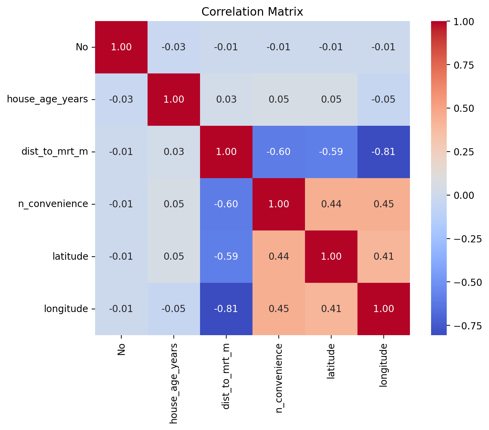
    


Draw a scatter plot of n_convenience vs. price_twd_msq:


```python
# Your code here
sns.scatterplot(data=df_estate, y='n_convenience', x='price_twd_msq')
```


    <Axes: xlabel='price_twd_msq', ylabel='n_convenience'>


    
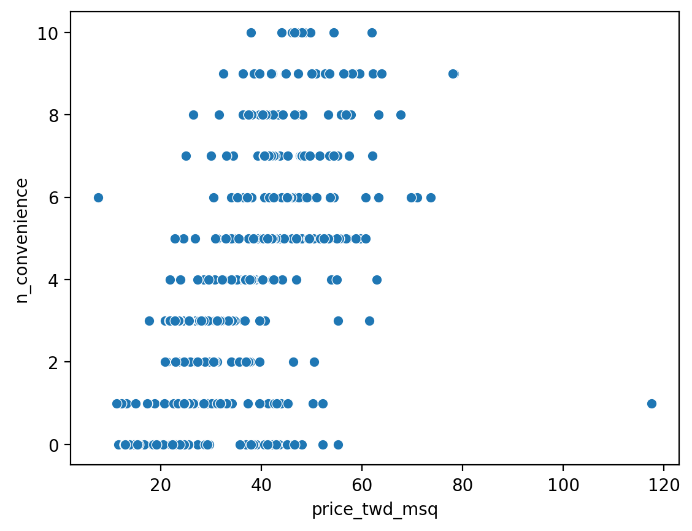
    


Draw a scatter plot of house_age_years vs. price_twd_msq:


```python
# Your code here
sns.scatterplot(data=df_estate, y='house_age_years', x='price_twd_msq')
```


    <Axes: xlabel='price_twd_msq', ylabel='house_age_years'>


    
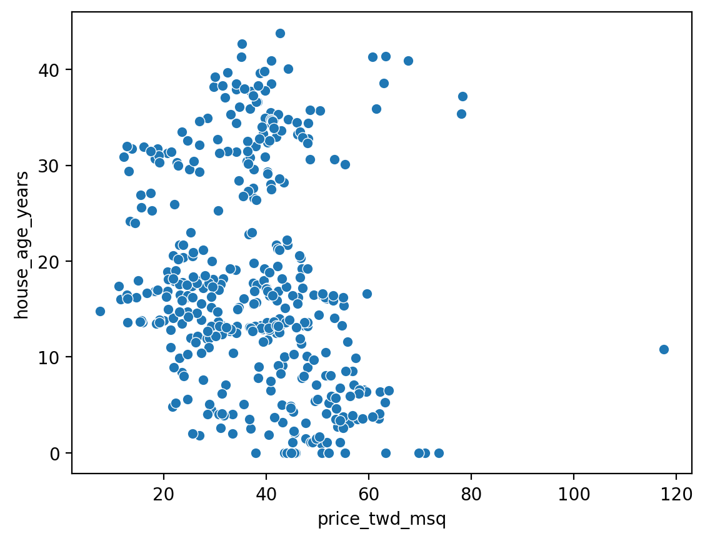
    


Draw a scatter plot of distance to nearest MRT station vs. price_twd_msq:


```python
# Your code here
sns.scatterplot(data=df_estate, y='dist_to_mrt_m', x='price_twd_msq')
```


    <Axes: xlabel='price_twd_msq', ylabel='dist_to_mrt_m'>


    
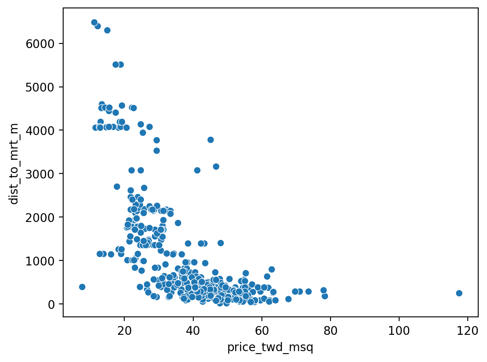
    


Plot a histogram of price_twd_msq with 10 bins, facet the plot so each house age group gets its own panel:


```python
# Your code here
df_estate.hist(column='price_twd_msq', by='house_age_cat_str', bins=10, figsize=(10, 6), layout=None, edgecolor='black');
plt.suptitle("Distribution of house price of unit area by house age group", y=1.02);
plt.tight_layout();
```

    C:\Users\krhij\AppData\Local\Temp\ipykernel_19444\1276067547.py:2: FutureWarning: The default of observed=False is deprecated and will be changed to True in a future version of pandas. Pass observed=False to retain current behavior or observed=True to adopt the future default and silence this warning.
      df_estate.hist(column='price_twd_msq', by='house_age_cat_str', bins=10, figsize=(10, 6), layout=None, edgecolor='black');
    


    
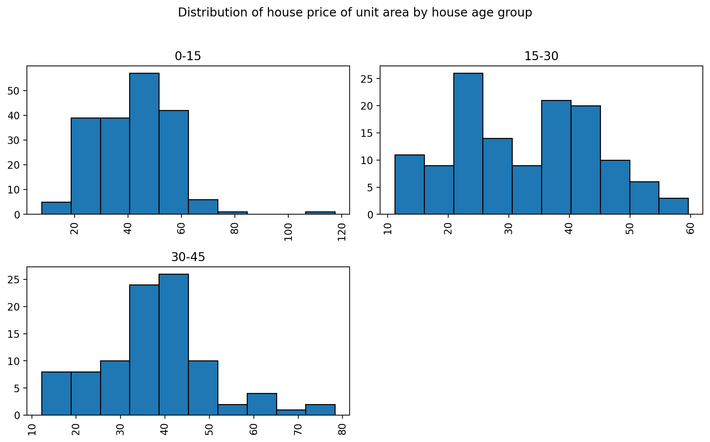
    


Summarize to calculate the mean, sd, median etc. house price/area by house age:


```python
# Your code here
df_estate.groupby('house_age_cat_str').describe() 
```

    C:\Users\krhij\AppData\Local\Temp\ipykernel_19444\979228561.py:2: FutureWarning: The default of observed=False is deprecated and will be changed to True in a future version of pandas. Pass observed=False to retain current behavior or observed=True to adopt the future default and silence this warning.
      df_estate.groupby('house_age_cat_str').describe()
    


<div>
<style scoped>
    .dataframe tbody tr th:only-of-type {
        vertical-align: middle;
    }

    .dataframe tbody tr th {
        vertical-align: top;
    }

    .dataframe thead tr th {
        text-align: left;
    }

    .dataframe thead tr:last-of-type th {
        text-align: right;
    }
</style>
<table border="1" class="dataframe">
  <thead>
    <tr>
      <th></th>
      <th colspan="8" halign="left">No</th>
      <th colspan="2" halign="left">house_age_years</th>
      <th>...</th>
      <th colspan="2" halign="left">house_age_30_45</th>
      <th colspan="8" halign="left">log_dist_to_mrt_m</th>
    </tr>
    <tr>
      <th></th>
      <th>count</th>
      <th>mean</th>
      <th>std</th>
      <th>min</th>
      <th>25%</th>
      <th>50%</th>
      <th>75%</th>
      <th>max</th>
      <th>count</th>
      <th>mean</th>
      <th>...</th>
      <th>75%</th>
      <th>max</th>
      <th>count</th>
      <th>mean</th>
      <th>std</th>
      <th>min</th>
      <th>25%</th>
      <th>50%</th>
      <th>75%</th>
      <th>max</th>
    </tr>
    <tr>
      <th>house_age_cat_str</th>
      <th></th>
      <th></th>
      <th></th>
      <th></th>
      <th></th>
      <th></th>
      <th></th>
      <th></th>
      <th></th>
      <th></th>
      <th></th>
      <th></th>
      <th></th>
      <th></th>
      <th></th>
      <th></th>
      <th></th>
      <th></th>
      <th></th>
      <th></th>
      <th></th>
    </tr>
  </thead>
  <tbody>
    <tr>
      <th>0-15</th>
      <td>190.0</td>
      <td>206.873684</td>
      <td>121.474080</td>
      <td>3.0</td>
      <td>104.5</td>
      <td>198.0</td>
      <td>318.5</td>
      <td>414.0</td>
      <td>190.0</td>
      <td>7.951579</td>
      <td>...</td>
      <td>0.0</td>
      <td>0.0</td>
      <td>190.0</td>
      <td>6.200424</td>
      <td>1.175475</td>
      <td>3.152002</td>
      <td>5.339414</td>
      <td>5.971038</td>
      <td>7.245666</td>
      <td>8.428095</td>
    </tr>
    <tr>
      <th>15-30</th>
      <td>129.0</td>
      <td>212.286822</td>
      <td>117.752799</td>
      <td>2.0</td>
      <td>116.0</td>
      <td>216.0</td>
      <td>305.0</td>
      <td>412.0</td>
      <td>129.0</td>
      <td>19.606977</td>
      <td>...</td>
      <td>0.0</td>
      <td>0.0</td>
      <td>129.0</td>
      <td>6.849662</td>
      <td>1.009191</td>
      <td>4.417471</td>
      <td>5.965690</td>
      <td>6.730688</td>
      <td>7.689430</td>
      <td>8.777713</td>
    </tr>
    <tr>
      <th>30-45</th>
      <td>95.0</td>
      <td>202.252632</td>
      <td>119.564544</td>
      <td>1.0</td>
      <td>94.5</td>
      <td>203.0</td>
      <td>307.0</td>
      <td>404.0</td>
      <td>95.0</td>
      <td>34.662105</td>
      <td>...</td>
      <td>1.0</td>
      <td>1.0</td>
      <td>95.0</td>
      <td>6.152439</td>
      <td>0.961165</td>
      <td>4.053339</td>
      <td>5.466404</td>
      <td>6.175239</td>
      <td>6.464149</td>
      <td>8.763472</td>
    </tr>
  </tbody>
</table>
<p>3 rows × 88 columns</p>
</div>


## Simple model

Run a linear regression of price_twd_msq vs. best, but only 1 predictor:


```python
import statsmodels.api as sm

# Let's use 'dist_to_mrt_m' as the single best predictor
X = df_estate[['dist_to_mrt_m']]
y = df_estate['price_twd_msq']

# Add constant for intercept
X = sm.add_constant(X)

# Fit the model
model1 = sm.OLS(y, X).fit()

# Show the summary
print(model1.summary())
```

                                OLS Regression Results                            
    ==============================================================================
    Dep. Variable:          price_twd_msq   R-squared:                       0.454
    Model:                            OLS   Adj. R-squared:                  0.452
    Method:                 Least Squares   F-statistic:                     342.2
    Date:                Mon, 02 Jun 2025   Prob (F-statistic):           4.64e-56
    Time:                        20:42:54   Log-Likelihood:                -1542.5
    No. Observations:                 414   AIC:                             3089.
    Df Residuals:                     412   BIC:                             3097.
    Df Model:                           1                                         
    Covariance Type:            nonrobust                                         
    =================================================================================
                        coef    std err          t      P>|t|      [0.025      0.975]
    ---------------------------------------------------------------------------------
    const            45.8514      0.653     70.258      0.000      44.569      47.134
    dist_to_mrt_m    -0.0073      0.000    -18.500      0.000      -0.008      -0.006
    ==============================================================================
    Omnibus:                      140.820   Durbin-Watson:                   2.151
    Prob(Omnibus):                  0.000   Jarque-Bera (JB):              988.283
    Skew:                           1.263   Prob(JB):                    2.49e-215
    Kurtosis:                      10.135   Cond. No.                     2.19e+03
    ==============================================================================
    
    Notes:
    [1] Standard Errors assume that the covariance matrix of the errors is correctly specified.
    [2] The condition number is large, 2.19e+03. This might indicate that there are
    strong multicollinearity or other numerical problems.
    

What do the above results mean? Write down the model and interpret it.

Discuss model accuracy.

y = 45.8514 - 0.0073x, where y - price_twd_msq, x - dist_to_mrt_m,
45.8514 means that at x = 0 (so at the MRT station), the house price of unit area would be the highest, 45.8514,
0.0073 is the rate of change of y with respect to x, so with each meter away from the MRT station, the house price of unit area would decrease by 0.0073,
R^2 is 0.454, so it is a moderate fit,
more predictors must be added to evaluate the house price more accurately

## Model diagnostics

### 4 Diagnostic plots


```python
fig = plt.figure(figsize=(12, 10))
sm.graphics.plot_regress_exog(model1, 'dist_to_mrt_m', fig=fig)
plt.show()
```


    
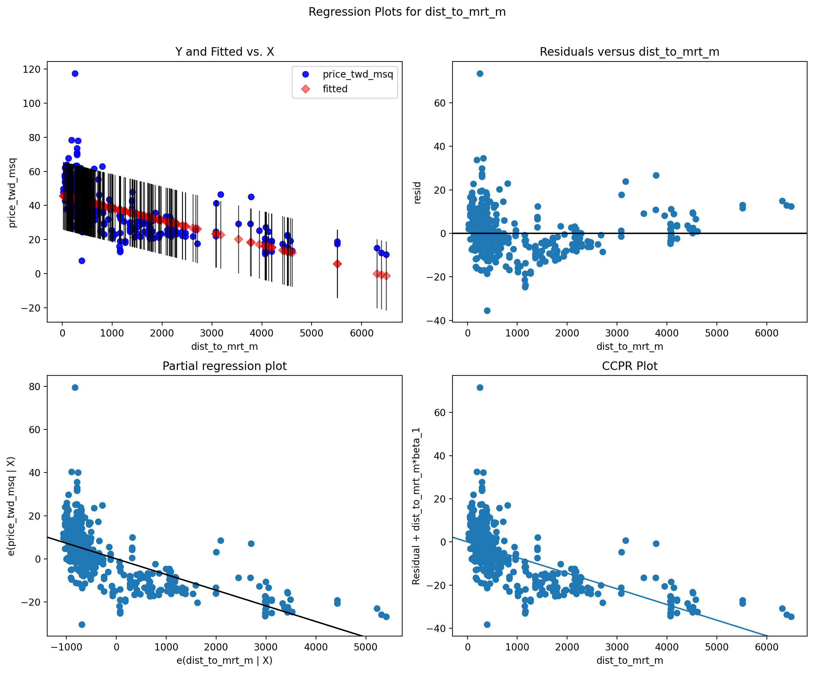
    


The four plots show...
The scatter of both values with a fitted line,
The scatter of OLS residuals versus dist_to_mrt_m,
Plot of models fitted values versus dist_to_mrt_m,
Partial-residual plot for a single regressor

### Outliers and high levarage points:


```python
fig, ax = plt.subplots(figsize=(8, 6))
sm.graphics.influence_plot(model1, ax=ax, criterion="cooks")
plt.title("Influence Plot (Outliers and High Leverage Points)")
plt.show()
```


    
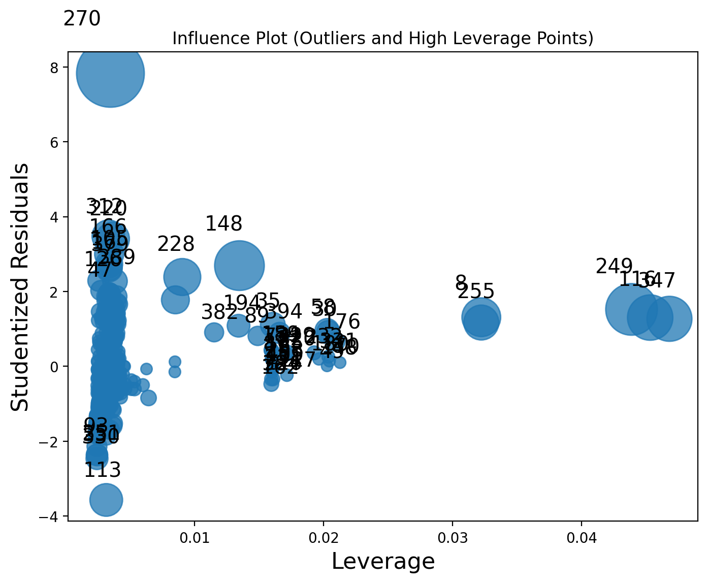
    


Discussion:
Most of the circles sit in a tight cluster near the middle, meaning those houses follow the general “price vs. distance” trend and don’t affect the line much. A single large circle way up at the top (point 270) shows a house whose price is far higher than expected — it pulls the line upward if you leave it in. A few circles out on the right edge (points 249, 147, 255) represent homes very far from any MRT station - even though their prices aren’t wildly off, their distance still shifts the slope of the line. In short: one extreme outlier high price and a handful of very‐distant homes are bending the straight‐line fit more than the rest of the data.


## Multiple Regression Model

### Test and training set 

We begin by splitting the dataset into two parts, training set and testing set. In this example we will randomly take 75% row in this dataset and put it into the training set, and other 25% row in the testing set:


```python
# One-hot encoding for house_age_cat_str in df_estate

encode_dict = {True: 1, False: 0}

house_age_0_15 = df_estate['house_age_cat_str'] == '0-15'
house_age_15_30 = df_estate['house_age_cat_str'] == '15-30'
house_age_30_45 = df_estate['house_age_cat_str'] == '30-45'

df_estate['house_age_0_15'] = house_age_0_15.map(encode_dict)
df_estate['house_age_15_30'] = house_age_15_30.map(encode_dict)
df_estate['house_age_30_45'] = house_age_30_45.map(encode_dict)

df_estate.head()
```


<div>
<style scoped>
    .dataframe tbody tr th:only-of-type {
        vertical-align: middle;
    }

    .dataframe tbody tr th {
        vertical-align: top;
    }

    .dataframe thead th {
        text-align: right;
    }
</style>
<table border="1" class="dataframe">
  <thead>
    <tr style="text-align: right;">
      <th></th>
      <th>No</th>
      <th>house_age_years</th>
      <th>dist_to_mrt_m</th>
      <th>n_convenience</th>
      <th>latitude</th>
      <th>longitude</th>
      <th>price_twd_msq</th>
      <th>house_age_cat</th>
      <th>house_age_cat_str</th>
      <th>house_age_0_15</th>
      <th>house_age_15_30</th>
      <th>house_age_30_45</th>
    </tr>
  </thead>
  <tbody>
    <tr>
      <th>0</th>
      <td>1</td>
      <td>32.0</td>
      <td>84.87882</td>
      <td>10</td>
      <td>24.98298</td>
      <td>121.54024</td>
      <td>37.9</td>
      <td>[30, 45)</td>
      <td>30-45</td>
      <td>0</td>
      <td>0</td>
      <td>1</td>
    </tr>
    <tr>
      <th>1</th>
      <td>2</td>
      <td>19.5</td>
      <td>306.59470</td>
      <td>9</td>
      <td>24.98034</td>
      <td>121.53951</td>
      <td>42.2</td>
      <td>[15, 30)</td>
      <td>15-30</td>
      <td>0</td>
      <td>1</td>
      <td>0</td>
    </tr>
    <tr>
      <th>2</th>
      <td>3</td>
      <td>13.3</td>
      <td>561.98450</td>
      <td>5</td>
      <td>24.98746</td>
      <td>121.54391</td>
      <td>47.3</td>
      <td>[0, 15)</td>
      <td>0-15</td>
      <td>1</td>
      <td>0</td>
      <td>0</td>
    </tr>
    <tr>
      <th>3</th>
      <td>4</td>
      <td>13.3</td>
      <td>561.98450</td>
      <td>5</td>
      <td>24.98746</td>
      <td>121.54391</td>
      <td>54.8</td>
      <td>[0, 15)</td>
      <td>0-15</td>
      <td>1</td>
      <td>0</td>
      <td>0</td>
    </tr>
    <tr>
      <th>4</th>
      <td>5</td>
      <td>5.0</td>
      <td>390.56840</td>
      <td>5</td>
      <td>24.97937</td>
      <td>121.54245</td>
      <td>43.1</td>
      <td>[0, 15)</td>
      <td>0-15</td>
      <td>1</td>
      <td>0</td>
      <td>0</td>
    </tr>
  </tbody>
</table>
</div>


```python
from sklearn.model_selection import train_test_split

# 75% training, 25% testing, random_state=12 for reproducibility
train, test = train_test_split(df_estate, train_size=0.75, random_state=12)
```

Now we have our training set and testing set. 

### Variable selection methods

Generally, selecting variables for linear regression is a debatable topic.

There are many methods for variable selecting, namely, forward stepwise selection, backward stepwise selection, etc, some are valid, some are heavily criticized.

I recommend this document: <https://www.stat.cmu.edu/~cshalizi/mreg/15/lectures/26/lecture-26.pdf> and Gung's comment: <https://stats.stackexchange.com/questions/20836/algorithms-for-automatic-model-selection/20856#20856> if you want to learn more about variable selection process.

[**If our goal is prediction**]{.ul}, it is safer to include all predictors in our model, removing variables without knowing the science behind it usually does more harm than good!!!

We begin to create our multiple linear regression model:


```python
import statsmodels.formula.api as smf
model2 = smf.ols('price_twd_msq ~ dist_to_mrt_m + house_age_0_15 + house_age_30_45', data = df_estate)
result2 = model2.fit()
result2.summary()
```


<table class="simpletable">
<caption>OLS Regression Results</caption>
<tr>
  <th>Dep. Variable:</th>      <td>price_twd_msq</td>  <th>  R-squared:         </th> <td>   0.485</td>
</tr>
<tr>
  <th>Model:</th>                   <td>OLS</td>       <th>  Adj. R-squared:    </th> <td>   0.482</td>
</tr>
<tr>
  <th>Method:</th>             <td>Least Squares</td>  <th>  F-statistic:       </th> <td>   128.9</td>
</tr>
<tr>
  <th>Date:</th>             <td>Mon, 02 Jun 2025</td> <th>  Prob (F-statistic):</th> <td>7.84e-59</td>
</tr>
<tr>
  <th>Time:</th>                 <td>20:42:56</td>     <th>  Log-Likelihood:    </th> <td> -1530.2</td>
</tr>
<tr>
  <th>No. Observations:</th>      <td>   414</td>      <th>  AIC:               </th> <td>   3068.</td>
</tr>
<tr>
  <th>Df Residuals:</th>          <td>   410</td>      <th>  BIC:               </th> <td>   3084.</td>
</tr>
<tr>
  <th>Df Model:</th>              <td>     3</td>      <th>                     </th>     <td> </td>   
</tr>
<tr>
  <th>Covariance Type:</th>      <td>nonrobust</td>    <th>                     </th>     <td> </td>   
</tr>
</table>
<table class="simpletable">
<tr>
         <td></td>            <th>coef</th>     <th>std err</th>      <th>t</th>      <th>P>|t|</th>  <th>[0.025</th>    <th>0.975]</th>  
</tr>
<tr>
  <th>Intercept</th>       <td>   43.4096</td> <td>    1.052</td> <td>   41.275</td> <td> 0.000</td> <td>   41.342</td> <td>   45.477</td>
</tr>
<tr>
  <th>dist_to_mrt_m</th>   <td>   -0.0070</td> <td>    0.000</td> <td>  -17.889</td> <td> 0.000</td> <td>   -0.008</td> <td>   -0.006</td>
</tr>
<tr>
  <th>house_age_0_15</th>  <td>    4.8450</td> <td>    1.143</td> <td>    4.239</td> <td> 0.000</td> <td>    2.598</td> <td>    7.092</td>
</tr>
<tr>
  <th>house_age_30_45</th> <td>   -0.1016</td> <td>    1.355</td> <td>   -0.075</td> <td> 0.940</td> <td>   -2.765</td> <td>    2.562</td>
</tr>
</table>
<table class="simpletable">
<tr>
  <th>Omnibus:</th>       <td>145.540</td> <th>  Durbin-Watson:     </th> <td>   2.124</td> 
</tr>
<tr>
  <th>Prob(Omnibus):</th> <td> 0.000</td>  <th>  Jarque-Bera (JB):  </th> <td>1077.318</td> 
</tr>
<tr>
  <th>Skew:</th>          <td> 1.296</td>  <th>  Prob(JB):          </th> <td>1.16e-234</td>
</tr>
<tr>
  <th>Kurtosis:</th>      <td>10.466</td>  <th>  Cond. No.          </th> <td>6.17e+03</td> 
</tr>
</table><br/><br/>Notes:<br/>[1] Standard Errors assume that the covariance matrix of the errors is correctly specified.<br/>[2] The condition number is large, 6.17e+03. This might indicate that there are<br/>strong multicollinearity or other numerical problems.


What about distance to mrt? Please plot its scatterplot with the dependent variable and verify, if any transformation is needed:


```python
# Your code here
sns.scatterplot(data=df_estate, x='dist_to_mrt_m', y='price_twd_msq')
```


    <Axes: xlabel='dist_to_mrt_m', ylabel='price_twd_msq'>


    
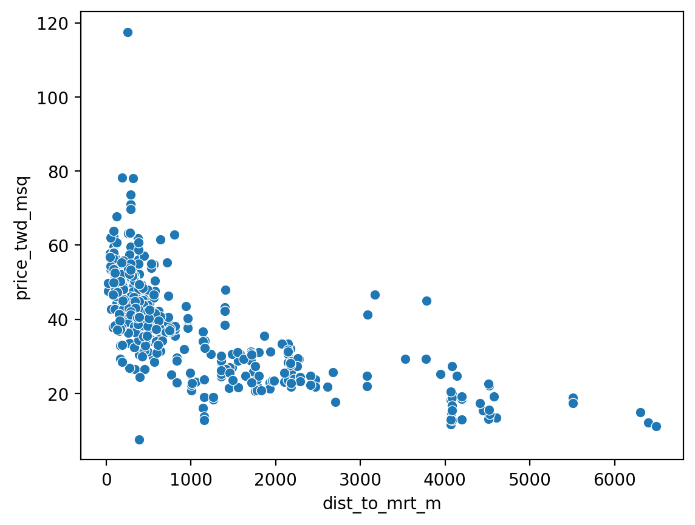
    


```python
# If any transformation is necessary, please estimate the Model3 with the transformed distance to mrt.

#transformation needed - not linear, i will use logarithmic tranformation

df_estate['log_dist_to_mrt_m'] = np.log(df_estate['dist_to_mrt_m'])

train, test = train_test_split(df_estate, train_size=0.75, random_state=12)

model3 = smf.ols('price_twd_msq ~ log_dist_to_mrt_m + house_age_0_15 + house_age_30_45', data = train)
result3 = model3.fit()
result3.summary()
```


<table class="simpletable">
<caption>OLS Regression Results</caption>
<tr>
  <th>Dep. Variable:</th>      <td>price_twd_msq</td>  <th>  R-squared:         </th> <td>   0.534</td>
</tr>
<tr>
  <th>Model:</th>                   <td>OLS</td>       <th>  Adj. R-squared:    </th> <td>   0.529</td>
</tr>
<tr>
  <th>Method:</th>             <td>Least Squares</td>  <th>  F-statistic:       </th> <td>   116.7</td>
</tr>
<tr>
  <th>Date:</th>             <td>Mon, 02 Jun 2025</td> <th>  Prob (F-statistic):</th> <td>2.09e-50</td>
</tr>
<tr>
  <th>Time:</th>                 <td>20:42:56</td>     <th>  Log-Likelihood:    </th> <td> -1138.7</td>
</tr>
<tr>
  <th>No. Observations:</th>      <td>   310</td>      <th>  AIC:               </th> <td>   2285.</td>
</tr>
<tr>
  <th>Df Residuals:</th>          <td>   306</td>      <th>  BIC:               </th> <td>   2300.</td>
</tr>
<tr>
  <th>Df Model:</th>              <td>     3</td>      <th>                     </th>     <td> </td>   
</tr>
<tr>
  <th>Covariance Type:</th>      <td>nonrobust</td>    <th>                     </th>     <td> </td>   
</tr>
</table>
<table class="simpletable">
<tr>
          <td></td>             <th>coef</th>     <th>std err</th>      <th>t</th>      <th>P>|t|</th>  <th>[0.025</th>    <th>0.975]</th>  
</tr>
<tr>
  <th>Intercept</th>         <td>   92.2668</td> <td>    3.607</td> <td>   25.577</td> <td> 0.000</td> <td>   85.168</td> <td>   99.365</td>
</tr>
<tr>
  <th>log_dist_to_mrt_m</th> <td>   -8.6918</td> <td>    0.508</td> <td>  -17.102</td> <td> 0.000</td> <td>   -9.692</td> <td>   -7.692</td>
</tr>
<tr>
  <th>house_age_0_15</th>    <td>    3.2571</td> <td>    1.298</td> <td>    2.509</td> <td> 0.013</td> <td>    0.702</td> <td>    5.812</td>
</tr>
<tr>
  <th>house_age_30_45</th>   <td>   -1.1490</td> <td>    1.578</td> <td>   -0.728</td> <td> 0.467</td> <td>   -4.254</td> <td>    1.956</td>
</tr>
</table>
<table class="simpletable">
<tr>
  <th>Omnibus:</th>       <td>148.479</td> <th>  Durbin-Watson:     </th> <td>   1.949</td>
</tr>
<tr>
  <th>Prob(Omnibus):</th> <td> 0.000</td>  <th>  Jarque-Bera (JB):  </th> <td>1535.696</td>
</tr>
<tr>
  <th>Skew:</th>          <td> 1.691</td>  <th>  Prob(JB):          </th> <td>    0.00</td>
</tr>
<tr>
  <th>Kurtosis:</th>      <td>13.366</td>  <th>  Cond. No.          </th> <td>    45.2</td>
</tr>
</table><br/><br/>Notes:<br/>[1] Standard Errors assume that the covariance matrix of the errors is correctly specified.


Discuss the results...
it will become more linear


```python
#Calculating residual standard error of Model1
mse_result1 = model1.mse_resid
rse_result1 = np.sqrt(mse_result1)
print('The residual standard error for the above model is:',np.round(mse_result1,3))
```

    The residual standard error for the above model is: 101.375
    


```python
#Calculating residual standard error of Model2
mse_result2 = result2.mse_resid
rse_result2 = np.sqrt(mse_result2)
print('The residual standard error for the above model is:',np.round(rse_result2,3))
```

    The residual standard error for the above model is: 9.796
    


```python
#Calculating residual standard error of Model3
mse_result3 = result3.mse_resid
rse_result3 = np.sqrt(mse_result3)
print('The residual standard error for the above model is:',np.round(rse_result3,3))
```

    The residual standard error for the above model is: 9.591
    

Looking at model summary, we see that variables .... house_age_30_45 are insignificant, so let's estimate the model without those variables:


```python
# Estimate next model here

#house_age_30_45 - insignificant variable

model4 = smf.ols('price_twd_msq ~ log_dist_to_mrt_m + house_age_0_15', data=train)
result4 = model4.fit()

result4.summary()

mse_result4 = result4.mse_resid
rse_result4 = np.sqrt(mse_result4)
print('The residual standard error for Model4 is:', np.round(rse_result4,3))
```

    The residual standard error for Model4 is: 9.584
    

### Evaluating multi-collinearity

There are many standards researchers apply for deciding whether a VIF is too large. In some domains, a VIF over 2 is worthy of suspicion. Others set the bar higher, at 5 or 10. Others still will say you shouldn't pay attention to these at all. Ultimately, the main thing to consider is that small effects are more likely to be "drowned out" by higher VIFs, but this may just be a natural, unavoidable fact with your model.


```python
from statsmodels.stats.outliers_influence import variance_inflation_factor
X_vif = df_estate[['dist_to_mrt_m', 'house_age_0_15', 'house_age_30_45']].copy()
X_vif = X_vif.fillna(0)  # Fill missing values if any

# Add constant (intercept)
X_vif = sm.add_constant(X_vif)

# Calculate VIF for each feature
vif_data = pd.DataFrame()
vif_data["feature"] = X_vif.columns
vif_data["VIF"] = [variance_inflation_factor(X_vif.values, i) for i in range(X_vif.shape[1])]

print(vif_data)
```

               feature       VIF
    0            const  4.772153
    1    dist_to_mrt_m  1.061497
    2   house_age_0_15  1.399276
    3  house_age_30_45  1.400308
    

Discuss the results...
We do not focus on the constant's VIF.
All real predictors have low VIF - such that is considered safe


Finally we test our best model on test dataset (change, if any transformation on dist_to_mrt_m was needed):


```python
# Prepare test predictors (must match training predictors)
X_test = test[['dist_to_mrt_m', 'house_age_0_15', 'house_age_30_45']].copy()
X_test = X_test.fillna(0)
X_test = sm.add_constant(X_test)

# True values
y_test = test['price_twd_msq']

# Predict using model2
y_pred = result2.predict(X_test)

# Calculate RMSE as an example metric
from sklearn.metrics import mean_squared_error
rmse = np.sqrt(mean_squared_error(y_test, y_pred))
print(f"Test RMSE: {rmse:.2f}")
```

    Test RMSE: 8.38
    

Interpret results...
It means that the predictions are on average 8.38 twd/m^2 from the real values. For the analysis to be meaningful, we must compare it to actual prices per m^2 - for low prices of around 20-30, this represents roughly 40-50%. For larger values of around 60-80, this percentage is smaller, but still quite substantial.


## Variable selection using best subset regression

*Best subset and stepwise (forward, backward, both) techniques of variable selection can be used to come up with the best linear regression model for the dependent variable medv.*


```python
# Best subset selection using sklearn's SequentialFeatureSelector (forward and backward)
from sklearn.feature_selection import SequentialFeatureSelector
from sklearn.linear_model import LinearRegression

# Prepare predictors and target
X = df_estate[['dist_to_mrt_m', 'n_convenience', 'house_age_0_15', 'house_age_15_30', 'house_age_30_45']]
y = df_estate['price_twd_msq']

# Initialize linear regression model
lr = LinearRegression()

# Forward stepwise selection
sfs_forward = SequentialFeatureSelector(lr, n_features_to_select='auto', direction='forward', cv=5)
sfs_forward.fit(X, y)
print("Forward selection support:", sfs_forward.get_support())
print("Selected features (forward):", X.columns[sfs_forward.get_support()].tolist())

# Backward stepwise selection
sfs_backward = SequentialFeatureSelector(lr, n_features_to_select='auto', direction='backward', cv=5)
sfs_backward.fit(X, y)
print("Backward selection support:", sfs_backward.get_support())
print("Selected features (backward):", X.columns[sfs_backward.get_support()].tolist())
```

    Forward selection support: [ True  True False False False]
    Selected features (forward): ['dist_to_mrt_m', 'n_convenience']
    Backward selection support: [ True  True False False  True]
    Selected features (backward): ['dist_to_mrt_m', 'n_convenience', 'house_age_30_45']
    

### Comparing competing models


```python
import statsmodels.api as sm

# Example: Compare AIC for models selected by forward and backward stepwise selection

# Forward selection model
features_forward = X.columns[sfs_forward.get_support()].tolist()
X_forward = df_estate[features_forward]
X_forward = sm.add_constant(X_forward)
model_forward = sm.OLS(y, X_forward).fit()
print("AIC (forward selection):", model_forward.aic)

# Backward selection model
features_backward = X.columns[sfs_backward.get_support()].tolist()
X_backward = df_estate[features_backward]
X_backward = sm.add_constant(X_backward)
model_backward = sm.OLS(y, X_backward).fit()
print("AIC (backward selection):", model_backward.aic)

# You can print summary for the best model (e.g., forward)
print(model_forward.summary())
```

    AIC (forward selection):

     3057.2813425866216
    AIC (backward selection): 3047.991777087278
                                OLS Regression Results                            
    ==============================================================================
    Dep. Variable:          price_twd_msq   R-squared:                       0.497
    Model:                            OLS   Adj. R-squared:                  0.494
    Method:                 Least Squares   F-statistic:                     202.7
    Date:                Mon, 02 Jun 2025   Prob (F-statistic):           5.61e-62
    Time:                        20:42:57   Log-Likelihood:                -1525.6
    No. Observations:                 414   AIC:                             3057.
    Df Residuals:                     411   BIC:                             3069.
    Df Model:                           2                                         
    Covariance Type:            nonrobust                                         
    =================================================================================
                        coef    std err          t      P>|t|      [0.025      0.975]
    ---------------------------------------------------------------------------------
    const            39.1229      1.300     30.106      0.000      36.568      41.677
    dist_to_mrt_m    -0.0056      0.000    -11.799      0.000      -0.007      -0.005
    n_convenience     1.1976      0.203      5.912      0.000       0.799       1.596
    ==============================================================================
    Omnibus:                      191.943   Durbin-Watson:                   2.126
    Prob(Omnibus):                  0.000   Jarque-Bera (JB):             2159.977
    Skew:                           1.671   Prob(JB):                         0.00
    Kurtosis:                      13.679   Cond. No.                     4.58e+03
    ==============================================================================
    
    Notes:
    [1] Standard Errors assume that the covariance matrix of the errors is correctly specified.
    [2] The condition number is large, 4.58e+03. This might indicate that there are
    strong multicollinearity or other numerical problems.
    

From Best subset regression and stepwise selection (forward, backward, both), we see that the models selected by forward and backward selection may include different sets of predictors, depending on their contribution to model fit. 

By comparing AIC values, the model with the lowest AIC is preferred, as it balances model complexity and goodness of fit.

In this case, the summary output for the best model (e.g., forward selection) shows which variables are most important for predicting price_twd_msq. This approach helps identify the most relevant predictors and avoid overfitting by excluding unnecessary variables.

Run model diagnostics for the BEST model:


```python
# Your code here
#the best model should be model4 - removed insignificant from already good model

#CCPR plot
fig1 = plt.figure(figsize=(12, 8))
sm.graphics.plot_regress_exog(result4, 'log_dist_to_mrt_m', fig=fig1)
plt.show()

#regression plots for 'house_age_0_15'
fig2 = plt.figure(figsize=(12, 8))
sm.graphics.plot_regress_exog(result4, 'house_age_0_15', fig=fig2)
plt.show()

#influence plot
fig3, ax = plt.subplots(figsize=(10, 7))
sm.graphics.influence_plot(result4, ax=ax, criterion="cooks")
plt.show()
```


    
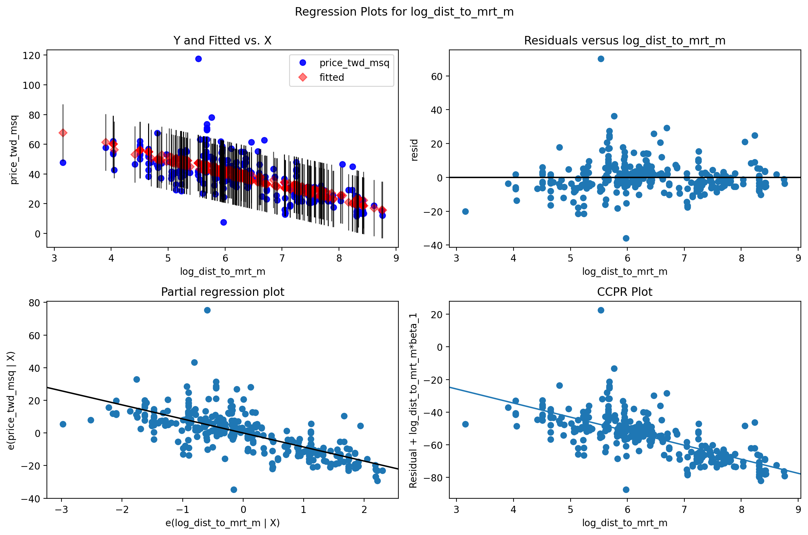
    


    
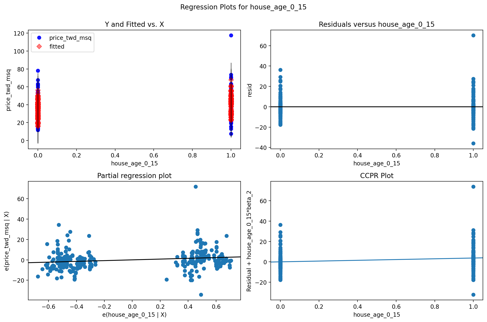
    


    
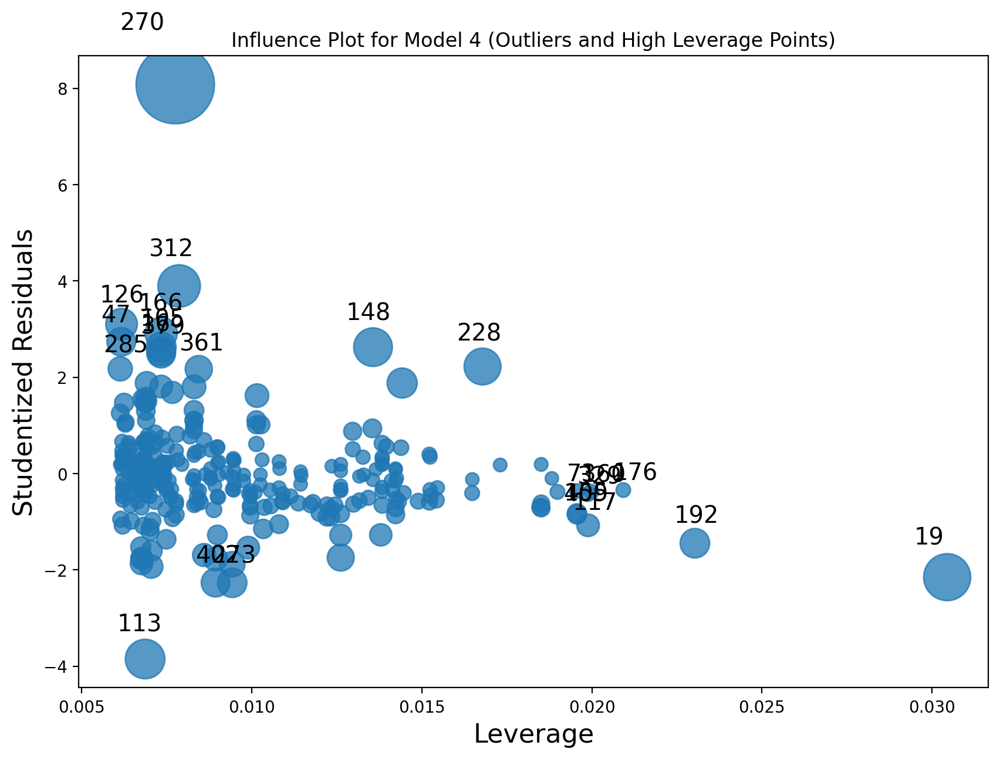
    


Finally, we can check the Out-of-sample Prediction or test error (MSPE):


```python
X_test = test[features_forward].copy()
X_test = X_test.fillna(0)
X_test = sm.add_constant(X_test)

# True values
y_test = test['price_twd_msq']

# Predict using the best model (e.g., forward selection)
y_pred = model_forward.predict(X_test)

# Calculate MSPE (Mean Squared Prediction Error)
mspe = np.mean((y_test - y_pred) ** 2)
print(f"Test MSPE (out-of-sample): {mspe:.2f}")
```

    Test MSPE (out-of-sample): 64.80
    

## Cross Validation

In Python, for cross-validation of regression models is usually done with cross_val_score from sklearn.model_selection.

To get the raw cross-validation estimate of prediction error (e.g., mean squared error), use:


```python
from sklearn.model_selection import cross_val_score
from sklearn.linear_model import LinearRegression

X = df_estate[['dist_to_mrt_m', 'house_age_0_15', 'house_age_30_45']]
y = df_estate['price_twd_msq']

model = LinearRegression()

# 5-fold cross-validation, scoring negative MSE (so we multiply by -1 to get positive MSE)
cv_scores = cross_val_score(model, X, y, cv=5, scoring='neg_mean_squared_error')

# Raw cross-validation estimate of prediction error (mean MSE)
cv_mse = -cv_scores.mean()
cv_rmse = np.sqrt(cv_mse)

print(f"Cross-validated MSE: {cv_mse:.2f}")
print(f"Cross-validated RMSE: {cv_rmse:.2f}")
```

    Cross-validated MSE: 95.90
    Cross-validated RMSE: 9.79
    

# Summary

1. Do you understand all numerical measures printed in the SUMMARY of the regression report?
2. Why do we need a cross-validation?
3. What are the diagnostic plots telling us?
4. How to compare similar, but competing models?
5. What is VIF telling us?
6. How to choose best set of predictors for the model?
